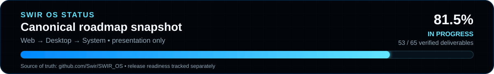

# 🖥️ SWIR OS — Public Status & Preview

**Presentation repository only**

`Swir/swir.github.io` hosts the public SWIR OS preview and synchronized development status. It is **not** a source repository for the operating system and does not own roadmap truth.

## Canonical project

All SWIR OS implementation is developed in **[Swir/SWIR_OS](https://github.com/Swir/SWIR_OS)**: Web Edition, Desktop Edition, System Edition, native applications, services, package/runtime infrastructure, Live USB/installer work, hardware and driver work, CI, roadmap, builds and releases.

The authoritative roadmap is [SWIR_OS/SWIR-OS-ARCHITECTURE.md](https://github.com/Swir/SWIR_OS/blob/main/SWIR-OS-ARCHITECTURE.md). This site mirrors verified values only after they are merged there.

## Current verified status

| Edition | Status |
|---|---|
| Web Edition | `1.7.13` |
| Desktop Edition | `0.5.7-preview` |
| System Edition | In development |
| Overall roadmap | **51 / 65 — 78.5%** |
| Release readiness | **Not ready** |

The latest verified System Edition work expands the authenticated native GTK4/Wayland desktop with four first-party daily-use application foundations: **SWIR Files, SWIR Settings, SWIR Notes and SWIR System Monitor**. All four map real GTK4 windows on Wayland and remain unprivileged. SWIR Notes stores a bounded personal note with owner-only permissions and atomic persistence. SWIR System Monitor provides bounded read-only Linux process, memory, load and uptime visibility without exposing process-kill or service-mutation controls. SWIR Files remains read-only for directory navigation until native Default Apps integration is ready, while SWIR Settings persists a small validated per-user preference set. The complete native daily-use application suite is still an open roadmap gate.

The existing boot/install path remains verified in disposable UEFI VMs: the final image boots as QEMU USB mass storage, the native GTK4 installer requires exact target review and destructive confirmation, installs to a separate blank disk, and the installed system boots graphically with persistence after the source USB is removed. The same integration head passed the graphical-session, Live USB install and full graphical-installer E2E gates. This is meaningful VM evidence, **not** a claim of broad physical-PC support. Physical Live USB boot/install qualification is still open, and Secure Boot plus legacy BIOS remain unclaimed until separately tested.

The canonical repo uses deterministic **SWIR Progress SVG PRO** assets generated from the authoritative roadmap. The card shown here is a presentation snapshot using the same visual language; its source of truth remains `Swir/SWIR_OS`.

Public progress here is updated only after the corresponding implementation is merged and verified in `Swir/SWIR_OS`. Current canonical milestone commit: [`26e28bc`](https://github.com/Swir/SWIR_OS/commit/26e28bc584b55141f2bac15874218e3d9de174c8).

## Repository role

This repository may contain website assets and older independent web/retro experiments. New SWIR OS product code, architecture contracts, System/Desktop/Web implementation, build tooling and authoritative progress calculations must be committed to `Swir/SWIR_OS`, not here.
